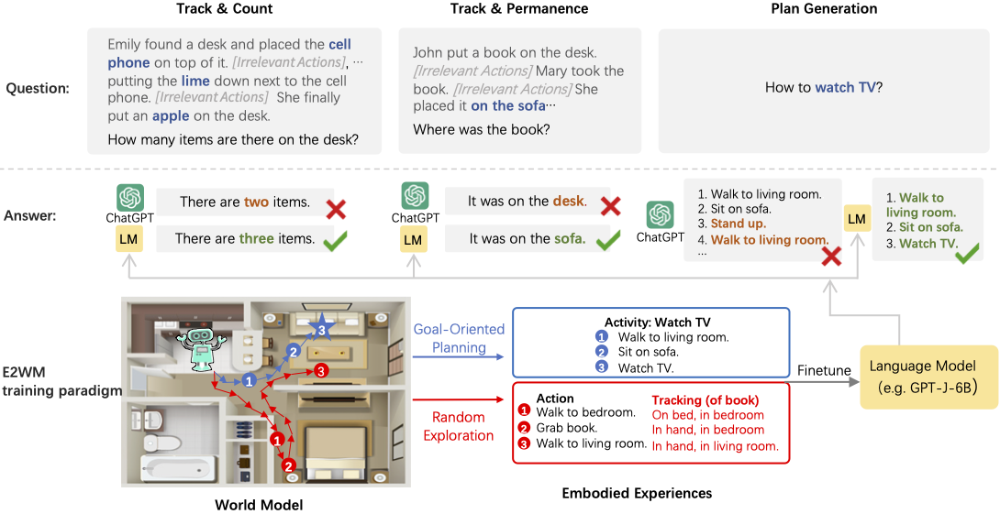

# World Model for Language Model
Official code for [Language Models Meet World Models: Embodied Experiences Enhance Language Models](https://arxiv.org/abs/2305.10626). Also check our [twitter](https://twitter.com/szxiangjn/status/1659399771126370304) here.
<div align=center>

</div>

## Setting Up
Install the dependencies by
```
pip install -r requirements.txt
```

## Train & Eval
First download [fisher-matrix-1.3B](https://huggingface.co/jiannanx/fisher-matrix-1.3B) and [fisher-matrix-6B](https://huggingface.co/jiannanx/fisher-matrix-6B), then put them under `fisher-matrix` directory.

Then go to the `scripts` directory where you can find all the training and evaluation scripts:
```
cd scripts
```
We provide usage examples of GPT-J-6B below. If you want to use GPJ-Neo-1.3B, just replace `6B` in the script name with `1.3B`.

### Train
If you want to train GPT-J-6B, use:
```
sh run_6B.sh
```
This script trains GPT-J-6B on a single GPU. 

If you want to do distributed training, first run this:
```
accelerate config --config_file accelerate_config.json
```
and follow the instructions to set up the config file. (We also provide a sample config file in `scripts`)

Then, you can simply run:
```
sh run_6B_multi_gpu.sh
```
### Eval
To do evaluation on QA tasks and generation tasks, run 
```
sh eval_qa_6B.sh
``` 
and 
```
sh eval_gen_6B.sh
``` 
The results will be stored in `output/ewc-lora-6B/qa-metric.txt` and `output/ewc-lora-6B/gen-metric.txt`, respectively.

If you want to do distributed evaluation for generation tasks, please modify `eval_gen_6B.sh` as:
1. Replace `python eval_gen.py` with `accelerate launch --config_file accelerate_config.json eval_gen.py`
2. Remove `export CUDA_VISIBLE_DEVICES=0` 

This is same as the change from `run_6B.sh` to `run_6B_multi_gpu.sh`.

## Citation
```
@article{xiang2023language,
  title={Language Models Meet World Models: Embodied Experiences Enhance Language Models},
  author={Xiang, Jiannan and Tao, Tianhua and Gu, Yi and Shu, Tianmin and Wang, Zirui and Yang, Zichao and Hu, Zhiting},
  journal={arXiv preprint arXiv:2305.10626},
  year={2023}
}
```
